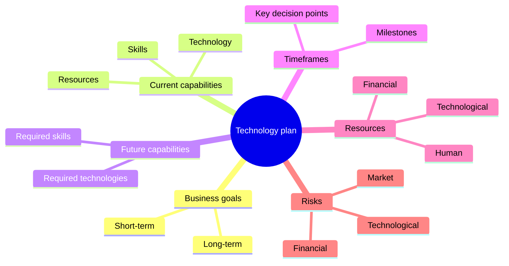

# Effective Technology Planning

Creating a technology development plan and its operationalization

Nikola Balić, niko@daytona.io — Rijeka, September 2023

---
transition: fade-out
---

# Why is technology planning crucial?

- When was the last time you were in a new city without Google Maps?

- Technology planning is your map to success
- It aligns your vision with market realities
- Helps you avoid costly mistakes and unnecessary wandering

---
layout: two-cols
---

# Understanding the technology lifecycle

<v-click>

> "Understanding the technology lifecycle means predicting the future and being a step ahead of the competition."

</v-click>

::right::

<v-click>

### Four phases of the lifecycle:
1. **Research phase (R&D):** when investment returns are negative and the chances of failure are high
2. **Growth phase:** when direct costs are covered and the technology starts to strengthen (A)
3. **Maturity phase:** when revenue is high and stable (M)
4. **Decline phase:** reduced revenue and usefulness of the technology (D) - Time for innovation or transformation

</v-click>

---

# Example of DVD technology lifecycle

<v-clicks>

- It has gone through all phases of the lifecycle:
  - R&D phase: Development in laboratories in the 1990s
  - Growth phase: Mass adoption in the early 2000s
  - Maturity phase: Market dominance in the mid-2000s
  - Decline phase: Gradual replacement by streaming technologies

> "Netflix is a great example of successful technology planning. They predicted the transition from physical DVDs to streaming, and began developing streaming technology while the DVD business was still thriving."

</v-clicks>

---

# Understanding the lifecycle helps:

<v-clicks>

- Better understand market trends and consumer behavior
- Identify opportunities for innovation and improvements
- Identify risks and challenges
- Assess the maturity of current technology
- Predict growth patterns
- Develop a strategy for investing in technologies

</v-clicks>

---
layout: center
class: text-center
---

# Introduction to Technology Plans

Your technology plan is more than just a document - it's your vision of the future translated into an action plan.

---



---

# What is roadmapping?

<v-clicks>

- A roadmap is a structured visual chronology of strategic intent.
- This definition emphasizes the key features of roadmaps, as structured, time-based visuals that support a strategic narrative about future possibilities and ambitions.

</v-clicks>

---

# Why is a roadmap important:

<v-clicks>

- Aligns technology strategy with business goals
- Helps in prioritizing
- Enables informed resource allocation
- Identifies and controls risks
- Enables progress tracking and adjustments

</v-clicks>

---

# Key elements of a roadmap:

<v-clicks>

- **Business goals**: Where do you want to go?
- **Current capabilities**: Where are you now?
- **Future capabilities**: What do you need to reach the goal?
- **Timeframes**: When do you want to arrive?
- **Resources**: What do you need for the journey?
- **Milestones**: How will you know you're on the right track?
- **Risks**: What obstacles can you expect?

</v-clicks>

---

# General roadmapping framework

### Four fundamental questions define the overall structure:

```
+-------+     +-------+
| Why?  |---->| What? |
+-------+     +-------+
    |             |
    v             v
+-------+     +-------+
| How?  |<--->| When? |
+-------+     +-------+
```

<v-click>

- The role of roadmapping is to provide an integrative visual structure for organizing answers to specific questions:
1. **Why?** (Trends and drivers)
2. **What?** (Value creation opportunities)
3. **How?** (Technologies and capabilities)
4. **When?** (Timeframe)

</v-click>

---

<v-clicks>

- From 'When' arise three further fundamental questions:
   - Where do we want to go?
   - Where are we now?
   - How can we get there?

In all roadmaps, for the strategy to be complete, there should be three broad layers (defined by 'why, what and how') that can be divided and displayed in relation to time ('when').
The question 'Who?' is included in each of the above as you decide who needs to be involved in the roadmap at certain times.

> "A good plan is like a compass - it shows you the direction, but leaves you the freedom to find the best path."

</v-clicks>

---

# Trends and drivers (Why?)

<v-clicks>

• High-level influences shaping the market
• Sets the context for market needs
• Evolves over time

</v-clicks>

---

# Market/industry needs (Why?)

<v-clicks>

• Develop in response to trends and drivers
• Represents the "pull" factor in innovations
• Key to aligning products with demand

</v-clicks>

---

# Value creation opportunities (What?)

<v-clicks>

• Potential products, services or systems
• Bridges market needs and technological capabilities
• Represents key offerings to be developed

</v-clicks>

---

# Technologies and capabilities (How?)

<v-clicks>

• Necessary for delivering value creation opportunities
• Represents the "push" factor in innovations
• Evolves to meet changing market needs

</v-clicks>

---

# Enablers (How?)

<v-clicks>

• Key support elements:
  - Funding
  - Infrastructure
  - Personnel/skills
• Foundation for successful innovations
• Supports all levels of the framework

</v-clicks>

---
layout: center
class: text-center
---

# Assessing your Technology Readiness Level (TRL): Where are you on your journey?

---

# Why it's important to know your TRL:

<v-clicks>

- Indicates the maturity and risk level of the technology
- Informs decisions about funding and development
- Helps in communicating with stakeholders
- You need to enter it in some EU form :-D

</v-clicks>

---

# Where are you?

<v-clicks>

Imagine TRL as a map with 9 points. Where are you?
- **TRL 1-3**: Research and concept (Beginning of the journey)
- **TRL 4-6**: Development and demonstration (Middle of the road)
- **TRL 7-9**: Implementation and operation (Near the goal)

</v-clicks>

---

# Example: TRL scale

<v-clicks>

- TRL 1-3: Research on battery technologies and electric motors
- TRL 4-6: Development of electric vehicle prototypes in laboratories and test tracks
- TRL 7-9: Tesla Roadster to mass production and commercialization - Tesla Model 3

</v-clicks>

---

# Standard TRL scale

<v-clicks>

- TRL 1 Basic principles observed
- TRL 2 Technology concept formulated
- TRL 3 Experimental proof of concept
- TRL 4 Technology validated in lab
- TRL 5 Technology validated in relevant environment
- TRL 6 Technology demonstrated in relevant environment
- TRL 7 System prototype demonstration in operational environment
- TRL 8 System complete and qualified
- TRL 9 Actual system proven in operational environment

</v-clicks>

---

# TRL 1-3

<v-clicks>

#### TRL 1 Basic principles observed:
- At this level, fundamental scientific research is conducted without a specific application in mind. The goal is to understand the basic principles of phenomena.
- Example: Research on quantum properties of materials for potential application in computing. Scientists study the behavior of electrons in different materials at the quantum level.

#### TRL 2 Technology concept formulated:
- Basic principles are applied to a specific idea or concept. Potential applications are formulated, but there's no experimental proof yet.
- Example: Concept of a quantum computer that would use superposition and quantum entanglement to perform complex calculations. Theorists develop mathematical models and algorithms.

#### TRL 3 Experimental proof of concept:
- Laboratory experiments are conducted to prove the feasibility of the concept. This is the first phase where theory meets practice.
- Example: Creation and manipulation of individual qubits in a laboratory environment. Scientists manage to control the state of one or two qubits under very controlled conditions.

</v-clicks>

---

# TRL 4-6

<v-clicks>

#### TRL 4 Technology validated in lab:
- Basic components of the technology are integrated to establish that they work together. Testing is conducted in strictly controlled conditions.
- Example: Integration of multiple qubits into a small quantum processor. Researchers manage to create a quantum register of several qubits and perform basic quantum operations.

#### TRL 5 Technology validated in relevant environment:
- The technology is tested in a simulated operational environment. Components are tested with full functionality, but not in a real system.
- Example: Testing a quantum processor with a larger number of qubits in conditions similar to those in a real computer. Experiments with quantum algorithms are conducted on a small set of problems.

#### TRL 6 Technology demonstrated in relevant environment:
- A prototype or representative model is tested in an environment very close to real. This is a critical phase in technology development.
- Example: Demonstration of a quantum computer that can solve specific problems faster than classical computers. Comparative tests with classical supercomputers are conducted on selected algorithms.

</v-clicks>

---

# TRL 7-9

<v-clicks>

#### TRL 7 System prototype demonstration in operational environment:
- The prototype is tested in a real operational environment. This is a significant step towards commercialization.
- Example: A quantum computer with enough qubits to solve practical problems is set up in a research center or company. Users begin experimenting with solving real problems.

#### TRL 8 System complete and qualified:
- The technology is proven to work in its final form and under expected conditions. All technical issues are resolved.
- Example: The quantum computer is fully functional and ready for commercial production. It has passed all reliability and performance tests and is compatible with existing infrastructure.

#### TRL 9 Actual system proven in operational environment:
- The technology is fully implemented and successfully operating in a real operational environment. This is the highest level of technological readiness.
- Example: Quantum computers are routinely used in industry, science, and government for solving complex optimization problems, materials simulation, cryptography, and machine learning.

</v-clicks>

---
layout: center
class: text-center
---

# mentimeter.com
4938 4677
https://www.menti.com/ala5bsf8hocq

---

# Operationalizing your plan

<v-click>

> "There is nothing quite so useless as doing with great efficiency something that should not be done at all." - Drucker

</v-click>

<v-click>

```
    +--------+     +---------+     +--------+     +---------+
    | Break  |     | Assign  |     | Review |     | Adapt & |
--->| into   |---->| Tasks & |---->|Progress|---->| Improve |---
    | Tasks  |     |Deadlines|     |        |     |         |  |
    +--------+     +---------+     +--------+     +---------+  |
         ^                                                     |
         |                                                     |
         +-----------------------------------------------------+
```

</v-click>

---

# From plan to action

<v-clicks>

1. Break the plan into concrete tasks
2. Assign responsible persons and deadlines
3. Regularly review progress
4. Be flexible and ready for adjustments

> Imagine you're building a house. It's not enough to have a blueprint - you need to coordinate workers, procure materials, track deadlines. The same applies to your technology plan.

</v-clicks>

---

# Key guidelines for effective roadmapping

<v-clicks>

- **Embrace flexibility and adaptability** in your roadmap
- **Focus on solving real customer problems**
- **Align technology decisions with business goals**
- **Ruthlessly prioritize** to maximize limited resources
- **Integrate continuous learning and data-driven decision making**
- **Clearly communicate the roadmap** to all stakeholders
- **Use the roadmap as a tool** for strategic alignment and execution

</v-clicks>

---

<v-clicks>

> Slack started as an internal communication tool for a company developing an online game. When they realized the potential of their internal tool, they adapted their plan and created a product that millions use today.

> Amazon Web Services (AWS) was born when Amazon realized they could monetize their internal cloud infrastructure.

</v-clicks>

---

# Benefits of roadmapping for success and growth

<v-clicks>

- Provides strategic direction and focus
- Aligns team efforts towards common goals
- Facilitates better resource allocation and prioritization
- Improves communication with investors and stakeholders
- Increases ability to adapt to market changes
- Accelerates learning and validation of business assumptions
- Increases chances of achieving product-market fit and successful scaling

</v-clicks>

---
layout: center
class: text-center
---

# Thank you!
niko@daytona.io
Questions and answers
