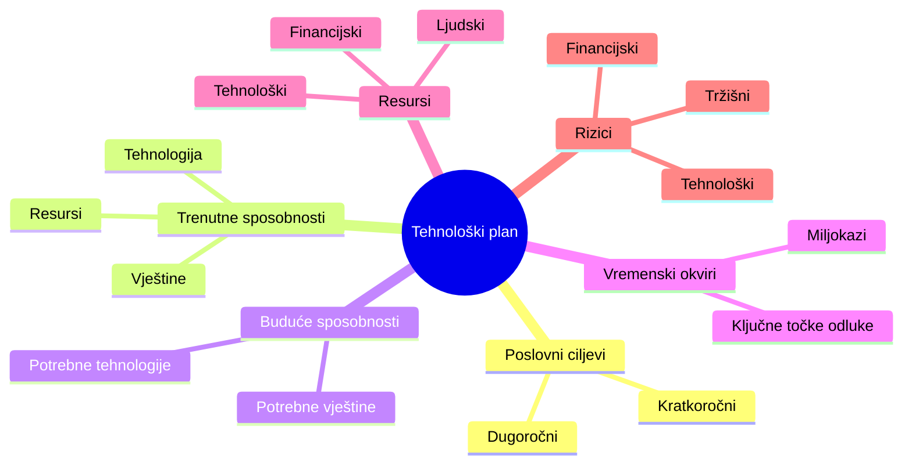
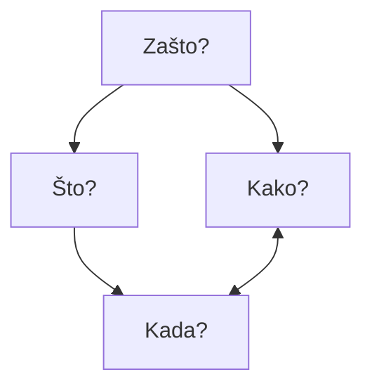
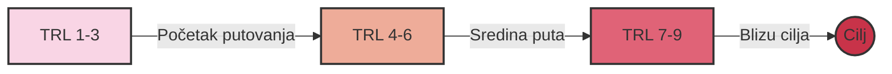

# Učinkovito tehnološko planiranje

### Kreiranje plana tehnološkog razvoja i njegova operacionalizacija

Nikola Balić, Head of Growth, Daytona.io
<br />
Rijeka, rujan 2024.

---
transition: fade-out
---

# Zašto je tehnološko planiranje ključno?

- Kada ste zadnji put bili u novom gradu bez Google Mapsa?

- Tehnološko planiranje je vaša mapa uspjeha
- Ono usklađuje vašu viziju s realnosti tržišta
- Pomaže vam izbjeći skupe pogreške i nepotrebna lutanja

---
layout: two-cols
---

# Razumijevanje životnog ciklusa tehnologije

<v-click>


</v-click>

::right::

<v-click>

### Četiri faze životnog ciklusa:
1. **Faza istraživanja (R&D):** kada su prihodi od ulaganja negativni i kada su izgledi za neuspjeh visoki
2. **Faza uspona:** kada su izravni troškovi pokriveni i tehnologija počinje jačati
3. **Faza zrelosti:** kada je prihod visok i stabilan
4. **Faza opadanja:** smanjeni prihodi i korisnost tehnologije - Vrijeme za inovaciju ili transformaciju

</v-click>

---
layout: statement
background: /background.jpg
---

# Razumjeti životni ciklus tehnologije znači predvidjeti budućnost i biti korak ispred konkurencije.

---
layout: two-cols
---

# Primjer životnog ciklusa DVD tehnologije

<v-clicks>

- Prošla kroz sve faze životnog ciklusa:
  - R&D faza: Razvoj u laboratorijima 1990-ih
  - Faza uspona: Masovno prihvaćanje ranih 2000-ih
  - Faza zrelosti: Dominacija tržišta sredinom 2000-ih
  - Faza opadanja: Postupna zamjena streaming tehnologijama

</v-clicks>

::right::

<v-clicks>


> "Netflix je odličan primjer uspješnog tehnološkog planiranja. Oni su predvidjeli prelazak s fizičkih DVD-ova na streaming, i počeli razvijati streaming tehnologiju dok je DVD posao još uvijek cvjetao."

</v-clicks>

---
layout: image
image: /assets/gartner_ai_hype.png
---


---
class: text-left
---

# Razumijevanje životnog ciklusa pomaže:

- Bolje razumjeti tržišne trendove i ponašanje potrošača
- Identificirati prilike za inovacije i poboljšanja
- Identificirati rizike i izazove
- Procijeniti zrelost trenutne tehnologije
- Predvidjeti obrasce rasta
- Razviti strategiju za ulaganje u tehnologije

---
layout: center
class: text-center
---

# Uvod u tehnološke planove

Vaš tehnološki plan je vizija budućnosti pretočena u akcijski plan.

---



---
layout: two-cols
---

# Što je planiranje (roadmapping)?

- Plan (roadmap) je strukturirana vizualna kronologija strateške namjere.
- Ova definicija naglašava ključne značajke planova, kao strukturiranih, vremenski određenih vizuala koji podržavaju strateški narativ o budućim mogućnostima i ambicijama.

::right::


---

# Zašto je plan važan:

- Usklađuje tehnološku strategiju s poslovnim ciljevima
- Pomaže u određivanju prioriteta
- Omogućuje informirano raspoređivanje resursa
- Identificira i kontrolira rizike
- Omogućuje praćenje napretka i prilagodbe

---

# Ključni elementi plana:

- **Poslovni ciljevi**: Kamo želite stići?
- **Trenutne sposobnosti**: Gdje ste sada?
- **Buduće sposobnosti**: Što vam treba da stignete do cilja?
- **Vremenski okviri**: Kada želite stići?
- **Resursi**: Što vam treba za put?
- **Miljokazi**: Kako ćete znati da ste na pravom putu?
- **Rizici**: Koje prepreke možete očekivati?

---
layout: two-cols
---

# Opći okvir planiranja

### Četiri temeljna pitanja definiraju cjelokupnu strukturu:

- Uloga planiranja je pružiti integrativnu vizualnu strukturu za organiziranje odgovora na specifična pitanja:
1. **Zašto?** (Trendovi i pokretači)
2. **Što?** (Prilike za stvaranje vrijednosti)
3. **Kako?** (Tehnologije i sposobnosti)
4. **Kada?** (Vremenski okvir)

::right::



---

# Iz 'Kada' proizlaze tri daljnja temeljna pitanja:

   - Kamo želimo ići?
   - Gdje smo sada?
   - Kako tamo možemo doći?

<v-clicks>

U svim planovima, da bi strategija bila potpuna, trebala bi postojati tri široka sloja (definirana s 'zašto, što i kako') koji se mogu podijeliti i prikazati u odnosu na vrijeme ('kada').

Pitanje 'Tko?' uključuje se u svako od gore navedenih dok odlučujete tko treba biti uključen u plan u određenim vremenima.

> "Dobar plan je kao kompas - pokazuje vam smjer, ali vam ostavlja slobodu da pronađete najbolji put."

</v-clicks>


---

# Trendovi i pokretači (Zašto?)

- Utjecaji visoke razine koji oblikuju tržište
- Postavlja kontekst za tržišne potrebe
- Razvija se tijekom vremena

---

# Tržišne/industrijske potrebe (Zašto?)

- Razvijaju se kao odgovor na trendove i pokretače
- Predstavlja Pull faktor u inovacijama
- Ključno za usklađivanje proizvoda s potražnjom

---

# Prilike za stvaranje vrijednosti (Što?)

- Potencijalni proizvodi, usluge ili sustavi
- Premošćuje tržišne potrebe i tehnološke mogućnosti
- Predstavlja ključne ponude koje treba razviti

---

# Tehnologije i sposobnosti (Kako?)

- Potrebno za isporuku prilika za stvaranje vrijednosti
- Predstavlja Push faktor u inovacijama
- Razvija se kako bi zadovoljio promjenjive tržišne potrebe

---
class: text-left
---

# Omogućitelji (Kako?)

- Ključni elementi podrške:
  - Financiranje
  - Infrastruktura
  - Osoblje/vještine
- Temelj za uspješne inovacije
- Podržava sve razine okvira

---
layout: center
class: text-center
---

# Procjena vaše tehnološke spremnosti (TRL)
### Gdje ste na svom putovanju?

---
layout: two-cols
---

# Zašto je važno znati vaš TRL:

- Ukazuje na zrelost i razinu rizika tehnologije
- Informira odluke o financiranju i razvoju
- Pomaže u komunikaciji s dionicima
- Trebate to upisati u nekakav EU obrazac 🤣

::right::

<v-click>


</v-click>

---

# Gdje se nalazite?

<v-clicks>

Zamislite TRL kao mapu s 9 točaka. Gdje se nalazite?
- **TRL 1-3**: Istraživanje i koncept
- **TRL 4-6**: Razvoj i demonstracija
- **TRL 7-9**: Implementacija i operacija



</v-clicks>

---

# Primjer: TRL ljestvica

<v-clicks>

- TRL 1-3: Istraživanje baterijskih tehnologija i električnih motora
- TRL 4-6: Razvoj prototipova električnih vozila u laboratorijima i testnim stazama
- TRL 7-9: Tesla Roadster do masovna proizvodnja i komercijalizacija - Tesla Model 3

</v-clicks>

---
layout: two-cols
---

# Standardna TRL ljestvica

<v-clicks>

- TRL 1 Promatrani osnovni principi
- TRL 2 Formulirani tehnološki koncept
- TRL 3 Eksperimentalni dokaz koncepta
- TRL 4 Validacija u laboratorijskom okruženju
- TRL 5 Validacija u relevantnom okruženju
- TRL 6 Demonstracija u relevantnom okruženju
- TRL 7 Demonstracija prototipa u operativnom okruženju
- TRL 8 Sustav dovršen i kvalificiran
- TRL 9 Dokazano u operativnom okruženju

</v-clicks>

::right::


---

# TRL 1-3

<v-clicks>

#### TRL 1 Promatrani osnovni principi:
- Temeljno znanstveno istraživanje bez specifične primjene u vidu. Cilj je razumjeti osnovne principe fenomena.
- Primjer: Istraživanje kvantnih svojstava materijala za potencijalnu primjenu u računalstvu. Znanstvenici **proučavaju ponašanje elektrona u različitim materijalima** na kvantnoj razini.

#### TRL 2 Formulirani tehnološki koncept:
- Osnovni principi se primjenjuju na specifičnu ideju ili koncept. Formuliraju se potencijalne primjene, ali još nema eksperimentalnih dokaza.
- Primjer: **Koncept kvantnog računala** koji bi koristio superpoziciju i kvantno sprezanje za izvođenje složenih izračuna. Teoretičari razvijaju **matematičke modele i algoritme**.

#### TRL 3 Eksperimentalni dokaz koncepta:
- Provode se laboratorijski eksperimenti kako bi se dokazala izvedivost koncepta.
- Primjer: Stvaranje i **manipulacija pojedinačnim qubitovima** u laboratorijskom okruženju. Znanstvenici uspijevaju kontrolirati stanje jednog ili dva qubita u vrlo kontroliranim uvjetima.

</v-clicks>

---

# TRL 4-6

<v-clicks>

#### TRL 4 Validacija u laboratorijskom okruženju:
- Komponente tehnologije se integriraju kako bi se utvrdilo da funkcioniraju zajedno. Testiranja u strogo kontroliranim uvjetima.
- Primjer: Integracija više qubita u mali kvantni procesor. Istraživači uspijevaju stvoriti **kvantni registar od nekoliko qubita i izvesti osnovne kvantne operacije**.

#### TRL 5 Validacija u relevantnom okruženju:
- Tehnologija se testira u simuliranom operativnom okruženju. Komponente se testiraju s punom funkcionalnosti, ali ne u stvarnom sustavu.
- Primjer: Testiranje **kvantnog procesora s većim brojem qubita** u uvjetima sličnim onima u stvarnom računalu. Provode se eksperimenti s kvantnim algoritmima na malom skupu problema.

#### TRL 6 Demonstracija u relevantnom okruženju:
- Prototip se testira u okruženju vrlo bliskom stvarnom. Ovo je kritična faza u razvoju tehnologije.
- Primjer: Demonstracija kvantnog računala koje može riješiti specifične probleme brže od klasičnih računala. Provode se **usporedni testovi s klasičnim superračunalima**.

</v-clicks>

---

# TRL 7-9

<v-clicks>

#### TRL 7 Demonstracija prototipa u operativnom okruženju:
- Prototip se testira u stvarnom operativnom okruženju.
- Primjer: Kvantno računalo s dovoljno qubita za rješavanje praktičnih problema postavlja se u istraživačkom centru ili tvrtki. **Korisnici počinju eksperimentirati** s rješavanjem stvarnih problema.

#### TRL 8 Sustav dovršen i kvalificiran:
- Tehnologija je dokazana da radi u svom konačnom obliku i pod očekivanim uvjetima. Svi tehnički problemi su riješeni.
- Primjer: Kvantno **računalo je potpuno funkcionalno i spremno za komercijalnu proizvodnju**. Prošlo je sve testove pouzdanosti i performansi te je kompatibilno s postojećom infrastrukturom.

#### TRL 9 Dokazano u operativnom okruženju:
- Tehnologija je u potpunosti implementirana i uspješno radi u stvarnom operativnom okruženju.
- Primjer: Kvantna računala se rutinski **koriste u industriji za rješavanje složenih problema** optimizacije, simulacije materijala, kriptografije i strojnog učenja.

</v-clicks>

---

# Procjena vašeg TRL-a

1. Identificirajte relevantne TRL kriterije za vašu tehnologiju
2. Prikupite dokaze koji podržavaju procjenu (Tehnička dokumentacija, testni podaci, povratne informacije korisnika, itd.)
3. Donesite procjenu o trenutnoj razini TRL-a
4. Zatražite mišljenje drugih koji su upoznati s tehnologijom
5. Koristite alate i okvire za procjenu TRL-a

Ključni faktori: zrelost, složenost, dostupnost podataka, vanjska ograničenja, resursi


---

<div class="flex justify-center">
  <div class="w-1/2 p-4">
    
  </div>
  <div class="w-1/2 p-4 flex flex-col justify-center">
    <h2 class="text-2xl font-bold mb-4">Vaš TRL?</h2>
    <p class="mb-2">Skenirajte QR ili unesite kod:</p>
    <p class="text-3xl font-bold">57 23 49 7</p>
    <a href="https://www.menti.com/altcqy1gbk14" class="mt-4">https://www.menti.com/altcqy1gbk14</a>
  </div>
</div>

---

<div style='position: relative; padding-bottom: 56.25%; padding-top: 35px; height: 0; overflow: hidden;'><iframe sandbox='allow-scripts allow-same-origin allow-presentation' allowfullscreen='true' allowtransparency='true' frameborder='0' height='315' src='https://www.mentimeter.com/app/presentation/alojyjrd9ceuhw6o75v8mpessz2anff7/embed' style='position: absolute; top: 0; left: 0; width: 100%; height: 100%;' width='420'></iframe></div>

---

# TTP Canvas

- Alat za transfer tehnologije u praksu
- Pomaže istraživačima u:
  - Pojašnjenju svrhe i vrijednosti istraživanja
  - Identifikaciji ciljanih klijenata
  - Planiranju aktivnosti za operacionalizaciju
  - Razvoju modela održivosti

<v-click>


</v-click>

---

# Operacionalizacija vašeg plana

<v-click>

> "There is nothing quite so useless as doing with great efficiency something that should not be done at all." - Drucker

</v-click>

<v-click>

```
    +--------+     +---------+     +--------+     +---------+
    | Break  |     | Assign  |     | Review |     | Adapt & |
--->| into   |---->| Tasks & |---->|Progress|---->| Improve |---
    | Tasks  |     |Deadlines|     |        |     |         |  |
    +--------+     +---------+     +--------+     +---------+  |
         ^                                                     |
         |                                                     |
         +-----------------------------------------------------+
```

</v-click>

---
layout: two-cols
---

# Od plana do akcije

<v-clicks>

1. Razbijte plan na konkretne zadatke
2. Odredite odgovorne osobe i rokove
3. Redovito pregledavajte napredak
4. Budite fleksibilni i spremni na prilagodbe

> Zamislite da gradite kuću. Nije dovoljno imati nacrt - morate koordinirati majstore, nabaviti materijale, pratiti rokove. Isto vrijedi i za vaš tehnološki plan.

</v-clicks>

::right::


---

# Ključne smjernice za učinkovito planiranje

- **Prihvatite fleksibilnost i prilagodljivost**
- **Fokusirajte se na rješavanje stvarnih problema kupaca**
- **Uskladite tehnološke odluke s poslovnim ciljevima**
- **Nemilosrdno prioritizirajte** kako biste maksimalno iskoristili ograničene resurse
- **Integrirajte kontinuirano učenje i odlučivanje temeljeno na podacima**
- **Jasno komunicirajte vaš plan** svim dionicima
- **Koristite plan kao alat** za strateško usklađivanje i izvršenje

<v-clicks>

> Slack je započeo kao alat za internu komunikaciju u tvrtki koja je razvijala online igru. Kada su shvatili potencijal svog internog alata, prilagodili su svoj plan i stvorili proizvod koji danas koriste milijuni.

> Amazon Web Services (AWS) je nastao kada je Amazon shvatio da može monetizirati svoju internu cloud infrastrukturu.

> Lidl isto -> StackIT

</v-clicks>

---
class: text-left
---

# Prednosti planiranja putanje za uspjeh i rast

- Pruža strateški smjer i fokus
- Usklađuje napore tima prema zajedničkim ciljevima
- Olakšava bolju raspodjelu resursa i određivanje prioriteta
- Poboljšava komunikaciju s investitorima i dionicima
- Povećava sposobnost prilagodbe tržišnim promjenama
- Ubrzava učenje i validaciju poslovnih pretpostavki
- Povećava šanse za postizanje product-market fita i uspješno skaliranje

---
layout: center
---

<div class="flex flex-col md:flex-row items-center justify-center space-y-4 md:space-y-0 md:space-x-8">
  <div class="w-full md:w-1/2 max-w-sm">
    
  </div>
  <div class="w-full md:w-1/2 max-w-sm flex flex-col justify-center">
    <h2 class="text-3xl md:text-4xl font-bold mb-4">Pitanja?</h2>
    <p class="text-lg md:text-xl">niko@daytona.io</p>
  </div>
</div>

---