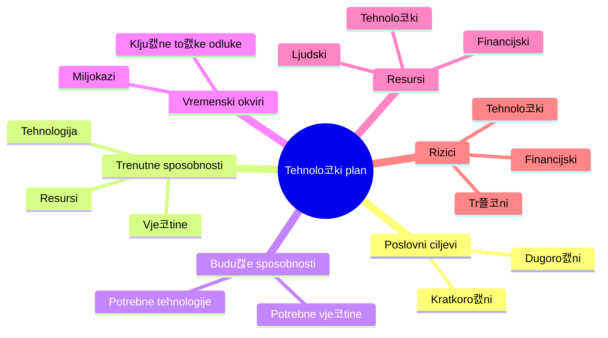
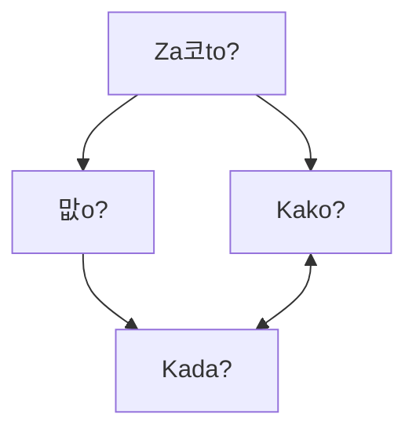
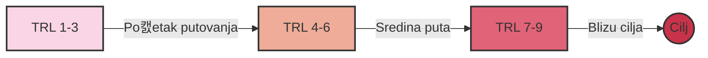

# U캜inkovito tehnolo코ko planiranje

### Kreiranje plana tehnolo코kog razvoja i njegova operacionalizacija

Nikola Bali캖, Head of Growth, Daytona.io
<br />
Rijeka, rujan 2024.

---
transition: fade-out
---

# Za코to je tehnolo코ko planiranje klju캜no?

- Kada ste zadnji put bili u novom gradu bez Google Mapsa?

- Tehnolo코ko planiranje je va코a mapa uspjeha
- Ono uskla캠uje va코u viziju s realnosti tr쬴코ta
- Poma쬰 vam izbje캖i skupe pogre코ke i nepotrebna lutanja

---
layout: two-cols
---

# Razumijevanje 쬴votnog ciklusa tehnologije

<v-click>


</v-click>

::right::

<v-click>

### 캛etiri faze 쬴votnog ciklusa:
1. **Faza istra쬴vanja (R&D):** kada su prihodi od ulaganja negativni i kada su izgledi za neuspjeh visoki
2. **Faza uspona:** kada su izravni tro코kovi pokriveni i tehnologija po캜inje ja캜ati
3. **Faza zrelosti:** kada je prihod visok i stabilan
4. **Faza opadanja:** smanjeni prihodi i korisnost tehnologije - Vrijeme za inovaciju ili transformaciju

</v-click>

---
layout: statement
background: /background.jpg
---

# Razumjeti 쬴votni ciklus tehnologije zna캜i predvidjeti budu캖nost i biti korak ispred konkurencije.

---
layout: two-cols
---

# Primjer 쬴votnog ciklusa DVD tehnologije

<v-clicks>

- Pro코la kroz sve faze 쬴votnog ciklusa:
  - R&D faza: Razvoj u laboratorijima 1990-ih
  - Faza uspona: Masovno prihva캖anje ranih 2000-ih
  - Faza zrelosti: Dominacija tr쬴코ta sredinom 2000-ih
  - Faza opadanja: Postupna zamjena streaming tehnologijama

</v-clicks>

::right::

<v-clicks>


> "Netflix je odli캜an primjer uspje코nog tehnolo코kog planiranja. Oni su predvidjeli prelazak s fizi캜kih DVD-ova na streaming, i po캜eli razvijati streaming tehnologiju dok je DVD posao jo코 uvijek cvjetao."

</v-clicks>

---
layout: image
image: /assets/gartner_ai_hype.png
---


---
class: text-left
---

# Razumijevanje 쬴votnog ciklusa poma쬰:

- Bolje razumjeti tr쬴코ne trendove i pona코anje potro코a캜a
- Identificirati prilike za inovacije i pobolj코anja
- Identificirati rizike i izazove
- Procijeniti zrelost trenutne tehnologije
- Predvidjeti obrasce rasta
- Razviti strategiju za ulaganje u tehnologije

---
layout: center
class: text-center
---

# Uvod u tehnolo코ke planove

Va코 tehnolo코ki plan je vizija budu캖nosti preto캜ena u akcijski plan.

---



---
layout: two-cols
---

# 맚o je planiranje (roadmapping)?

- Plan (roadmap) je strukturirana vizualna kronologija strate코ke namjere.
- Ova definicija nagla코ava klju캜ne zna캜ajke planova, kao strukturiranih, vremenski odre캠enih vizuala koji podr쬬vaju strate코ki narativ o budu캖im mogu캖nostima i ambicijama.

::right::


---

# Za코to je plan va쬬n:

- Uskla캠uje tehnolo코ku strategiju s poslovnim ciljevima
- Poma쬰 u odre캠ivanju prioriteta
- Omogu캖uje informirano raspore캠ivanje resursa
- Identificira i kontrolira rizike
- Omogu캖uje pra캖enje napretka i prilagodbe

---

# Klju캜ni elementi plana:

- **Poslovni ciljevi**: Kamo 쬰lite sti캖i?
- **Trenutne sposobnosti**: Gdje ste sada?
- **Budu캖e sposobnosti**: 맚o vam treba da stignete do cilja?
- **Vremenski okviri**: Kada 쬰lite sti캖i?
- **Resursi**: 맚o vam treba za put?
- **Miljokazi**: Kako 캖ete znati da ste na pravom putu?
- **Rizici**: Koje prepreke mo쬰te o캜ekivati?

---
layout: two-cols
---

# Op캖i okvir planiranja

### 캛etiri temeljna pitanja definiraju cjelokupnu strukturu:

- Uloga planiranja je pru쬴ti integrativnu vizualnu strukturu za organiziranje odgovora na specifi캜na pitanja:
1. **Za코to?** (Trendovi i pokreta캜i)
2. **맚o?** (Prilike za stvaranje vrijednosti)
3. **Kako?** (Tehnologije i sposobnosti)
4. **Kada?** (Vremenski okvir)

::right::



---

# Iz 'Kada' proizlaze tri daljnja temeljna pitanja:

   - Kamo 쬰limo i캖i?
   - Gdje smo sada?
   - Kako tamo mo쬰mo do캖i?

<v-clicks>

U svim planovima, da bi strategija bila potpuna, trebala bi postojati tri 코iroka sloja (definirana s 'za코to, 코to i kako') koji se mogu podijeliti i prikazati u odnosu na vrijeme ('kada').

Pitanje 'Tko?' uklju캜uje se u svako od gore navedenih dok odlu캜ujete tko treba biti uklju캜en u plan u odre캠enim vremenima.

> "Dobar plan je kao kompas - pokazuje vam smjer, ali vam ostavlja slobodu da prona캠ete najbolji put."

</v-clicks>


---

# Trendovi i pokreta캜i (Za코to?)

- Utjecaji visoke razine koji oblikuju tr쬴코te
- Postavlja kontekst za tr쬴코ne potrebe
- Razvija se tijekom vremena

---

# Tr쬴코ne/industrijske potrebe (Za코to?)

- Razvijaju se kao odgovor na trendove i pokreta캜e
- Predstavlja Pull faktor u inovacijama
- Klju캜no za uskla캠ivanje proizvoda s potra쬹jom

---

# Prilike za stvaranje vrijednosti (맚o?)

- Potencijalni proizvodi, usluge ili sustavi
- Premo코캖uje tr쬴코ne potrebe i tehnolo코ke mogu캖nosti
- Predstavlja klju캜ne ponude koje treba razviti

---

# Tehnologije i sposobnosti (Kako?)

- Potrebno za isporuku prilika za stvaranje vrijednosti
- Predstavlja Push faktor u inovacijama
- Razvija se kako bi zadovoljio promjenjive tr쬴코ne potrebe

---
class: text-left
---

# Omogu캖itelji (Kako?)

- Klju캜ni elementi podr코ke:
  - Financiranje
  - Infrastruktura
  - Osoblje/vje코tine
- Temelj za uspje코ne inovacije
- Podr쬬va sve razine okvira

---
layout: center
class: text-center
---

# Procjena va코e tehnolo코ke spremnosti (TRL)
### Gdje ste na svom putovanju?

---
layout: two-cols
---

# Za코to je va쬹o znati va코 TRL:

- Ukazuje na zrelost i razinu rizika tehnologije
- Informira odluke o financiranju i razvoju
- Poma쬰 u komunikaciji s dionicima
- Trebate to upisati u nekakav EU obrazac 游뱎

::right::

<v-click>


</v-click>

---

# Gdje se nalazite?

<v-clicks>

Zamislite TRL kao mapu s 9 to캜aka. Gdje se nalazite?
- **TRL 1-3**: Istra쬴vanje i koncept
- **TRL 4-6**: Razvoj i demonstracija
- **TRL 7-9**: Implementacija i operacija



</v-clicks>

---

# Primjer: TRL ljestvica

<v-clicks>

- TRL 1-3: Istra쬴vanje baterijskih tehnologija i elektri캜nih motora
- TRL 4-6: Razvoj prototipova elektri캜nih vozila u laboratorijima i testnim stazama
- TRL 7-9: Tesla Roadster do masovna proizvodnja i komercijalizacija - Tesla Model 3

</v-clicks>

---
layout: two-cols
---

# Standardna TRL ljestvica

<v-clicks>

- TRL 1 Promatrani osnovni principi
- TRL 2 Formulirani tehnolo코ki koncept
- TRL 3 Eksperimentalni dokaz koncepta
- TRL 4 Validacija u laboratorijskom okru쬰nju
- TRL 5 Validacija u relevantnom okru쬰nju
- TRL 6 Demonstracija u relevantnom okru쬰nju
- TRL 7 Demonstracija prototipa u operativnom okru쬰nju
- TRL 8 Sustav dovr코en i kvalificiran
- TRL 9 Dokazano u operativnom okru쬰nju

</v-clicks>

::right::


---

# TRL 1-3

<v-clicks>

#### TRL 1 Promatrani osnovni principi:
- Temeljno znanstveno istra쬴vanje bez specifi캜ne primjene u vidu. Cilj je razumjeti osnovne principe fenomena.
- Primjer: Istra쬴vanje kvantnih svojstava materijala za potencijalnu primjenu u ra캜unalstvu. Znanstvenici **prou캜avaju pona코anje elektrona u razli캜itim materijalima** na kvantnoj razini.

#### TRL 2 Formulirani tehnolo코ki koncept:
- Osnovni principi se primjenjuju na specifi캜nu ideju ili koncept. Formuliraju se potencijalne primjene, ali jo코 nema eksperimentalnih dokaza.
- Primjer: **Koncept kvantnog ra캜unala** koji bi koristio superpoziciju i kvantno sprezanje za izvo캠enje slo쬰nih izra캜una. Teoreti캜ari razvijaju **matemati캜ke modele i algoritme**.

#### TRL 3 Eksperimentalni dokaz koncepta:
- Provode se laboratorijski eksperimenti kako bi se dokazala izvedivost koncepta.
- Primjer: Stvaranje i **manipulacija pojedina캜nim qubitovima** u laboratorijskom okru쬰nju. Znanstvenici uspijevaju kontrolirati stanje jednog ili dva qubita u vrlo kontroliranim uvjetima.

</v-clicks>

---

# TRL 4-6

<v-clicks>

#### TRL 4 Validacija u laboratorijskom okru쬰nju:
- Komponente tehnologije se integriraju kako bi se utvrdilo da funkcioniraju zajedno. Testiranja u strogo kontroliranim uvjetima.
- Primjer: Integracija vi코e qubita u mali kvantni procesor. Istra쬴va캜i uspijevaju stvoriti **kvantni registar od nekoliko qubita i izvesti osnovne kvantne operacije**.

#### TRL 5 Validacija u relevantnom okru쬰nju:
- Tehnologija se testira u simuliranom operativnom okru쬰nju. Komponente se testiraju s punom funkcionalnosti, ali ne u stvarnom sustavu.
- Primjer: Testiranje **kvantnog procesora s ve캖im brojem qubita** u uvjetima sli캜nim onima u stvarnom ra캜unalu. Provode se eksperimenti s kvantnim algoritmima na malom skupu problema.

#### TRL 6 Demonstracija u relevantnom okru쬰nju:
- Prototip se testira u okru쬰nju vrlo bliskom stvarnom. Ovo je kriti캜na faza u razvoju tehnologije.
- Primjer: Demonstracija kvantnog ra캜unala koje mo쬰 rije코iti specifi캜ne probleme br쬰 od klasi캜nih ra캜unala. Provode se **usporedni testovi s klasi캜nim superra캜unalima**.

</v-clicks>

---

# TRL 7-9

<v-clicks>

#### TRL 7 Demonstracija prototipa u operativnom okru쬰nju:
- Prototip se testira u stvarnom operativnom okru쬰nju.
- Primjer: Kvantno ra캜unalo s dovoljno qubita za rje코avanje prakti캜nih problema postavlja se u istra쬴va캜kom centru ili tvrtki. **Korisnici po캜inju eksperimentirati** s rje코avanjem stvarnih problema.

#### TRL 8 Sustav dovr코en i kvalificiran:
- Tehnologija je dokazana da radi u svom kona캜nom obliku i pod o캜ekivanim uvjetima. Svi tehni캜ki problemi su rije코eni.
- Primjer: Kvantno **ra캜unalo je potpuno funkcionalno i spremno za komercijalnu proizvodnju**. Pro코lo je sve testove pouzdanosti i performansi te je kompatibilno s postoje캖om infrastrukturom.

#### TRL 9 Dokazano u operativnom okru쬰nju:
- Tehnologija je u potpunosti implementirana i uspje코no radi u stvarnom operativnom okru쬰nju.
- Primjer: Kvantna ra캜unala se rutinski **koriste u industriji za rje코avanje slo쬰nih problema** optimizacije, simulacije materijala, kriptografije i strojnog u캜enja.

</v-clicks>

---

# Procjena va코eg TRL-a

1. Identificirajte relevantne TRL kriterije za va코u tehnologiju
2. Prikupite dokaze koji podr쬬vaju procjenu (Tehni캜ka dokumentacija, testni podaci, povratne informacije korisnika, itd.)
3. Donesite procjenu o trenutnoj razini TRL-a
4. Zatra쬴te mi코ljenje drugih koji su upoznati s tehnologijom
5. Koristite alate i okvire za procjenu TRL-a

Klju캜ni faktori: zrelost, slo쬰nost, dostupnost podataka, vanjska ograni캜enja, resursi


---

<div class="flex justify-center">
  <div class="w-1/2 p-4">
    
  </div>
  <div class="w-1/2 p-4 flex flex-col justify-center">
    <h2 class="text-2xl font-bold mb-4">Va코 TRL?</h2>
    <p class="mb-2">Skenirajte QR ili unesite kod:</p>
    <p class="text-3xl font-bold">57 23 49 7</p>
    <a href="https://www.menti.com/altcqy1gbk14" class="mt-4">https://www.menti.com/altcqy1gbk14</a>
  </div>
</div>

---

<div style='position: relative; padding-bottom: 56.25%; padding-top: 35px; height: 0; overflow: hidden;'><iframe sandbox='allow-scripts allow-same-origin allow-presentation' allowfullscreen='true' allowtransparency='true' frameborder='0' height='315' src='https://www.mentimeter.com/app/presentation/alojyjrd9ceuhw6o75v8mpessz2anff7/embed' style='position: absolute; top: 0; left: 0; width: 100%; height: 100%;' width='420'></iframe></div>

---

# TTP Canvas

- Alat za transfer tehnologije u praksu
- Poma쬰 istra쬴va캜ima u:
  - Poja코njenju svrhe i vrijednosti istra쬴vanja
  - Identifikaciji ciljanih klijenata
  - Planiranju aktivnosti za operacionalizaciju
  - Razvoju modela odr쬴vosti

<v-click>


</v-click>

---

# Operacionalizacija va코eg plana

<v-click>

> "There is nothing quite so useless as doing with great efficiency something that should not be done at all." - Drucker

</v-click>

<v-click>

```
    +--------+     +---------+     +--------+     +---------+
    | Break  |     | Assign  |     | Review |     | Adapt & |
--->| into   |---->| Tasks & |---->|Progress|---->| Improve |---
    | Tasks  |     |Deadlines|     |        |     |         |  |
    +--------+     +---------+     +--------+     +---------+  |
         ^                                                     |
         |                                                     |
         +-----------------------------------------------------+
```

</v-click>

---
layout: two-cols
---

# Od plana do akcije

<v-clicks>

1. Razbijte plan na konkretne zadatke
2. Odredite odgovorne osobe i rokove
3. Redovito pregledavajte napredak
4. Budite fleksibilni i spremni na prilagodbe

> Zamislite da gradite ku캖u. Nije dovoljno imati nacrt - morate koordinirati majstore, nabaviti materijale, pratiti rokove. Isto vrijedi i za va코 tehnolo코ki plan.

</v-clicks>

::right::


---

# Klju캜ne smjernice za u캜inkovito planiranje

- **Prihvatite fleksibilnost i prilagodljivost**
- **Fokusirajte se na rje코avanje stvarnih problema kupaca**
- **Uskladite tehnolo코ke odluke s poslovnim ciljevima**
- **Nemilosrdno prioritizirajte** kako biste maksimalno iskoristili ograni캜ene resurse
- **Integrirajte kontinuirano u캜enje i odlu캜ivanje temeljeno na podacima**
- **Jasno komunicirajte va코 plan** svim dionicima
- **Koristite plan kao alat** za strate코ko uskla캠ivanje i izvr코enje

<v-clicks>

> Slack je zapo캜eo kao alat za internu komunikaciju u tvrtki koja je razvijala online igru. Kada su shvatili potencijal svog internog alata, prilagodili su svoj plan i stvorili proizvod koji danas koriste milijuni.

> Amazon Web Services (AWS) je nastao kada je Amazon shvatio da mo쬰 monetizirati svoju internu cloud infrastrukturu.

> Lidl isto -> StackIT

</v-clicks>

---
class: text-left
---

# Prednosti planiranja putanje za uspjeh i rast

- Pru쬬 strate코ki smjer i fokus
- Uskla캠uje napore tima prema zajedni캜kim ciljevima
- Olak코ava bolju raspodjelu resursa i odre캠ivanje prioriteta
- Pobolj코ava komunikaciju s investitorima i dionicima
- Pove캖ava sposobnost prilagodbe tr쬴코nim promjenama
- Ubrzava u캜enje i validaciju poslovnih pretpostavki
- Pove캖ava 코anse za postizanje product-market fita i uspje코no skaliranje

---
layout: center
---

<div class="flex flex-col md:flex-row items-center justify-center space-y-4 md:space-y-0 md:space-x-8">
  <div class="w-full md:w-1/2 max-w-sm">
    
  </div>
  <div class="w-full md:w-1/2 max-w-sm flex flex-col justify-center">
    <h2 class="text-3xl md:text-4xl font-bold mb-4">Pitanja?</h2>
    <p class="text-lg md:text-xl">niko@daytona.io</p>
  </div>
</div>

---