```mermaid
mindmap
  root((Tehnološki plan))
    Poslovni ciljevi
      Kratkoročni
      Dugoročni
    Trenutne sposobnosti
      Tehnologija
      Vještine
      Resursi
    Buduće sposobnosti
      Potrebne tehnologije
      Potrebne vještine
    Vremenski okviri
      Miljokazi
      Ključne točke odluke
    Resursi
      Financijski
      Ljudski
      Tehnološki
    Rizici
      Tržišni
      Tehnološki
      Financijski
```

```mermaid {theme: 'forest', scale: 1.5}
graph TD
    A[Zašto?] --> B[Što?]
    A --> C[Kako?]
    B --> D[Kada?]
    C <--> D
```

# Učinkovito tehnološko planiranje

Kreiranje plana tehnološkog razvoja i njegova operacionalizacija

Nikola Balić, niko@daytona.io — Rijeka, rujan 2024.

---
transition: fade-out
---

# Zašto je tehnološko planiranje ključno?

- Kada ste zadnji put bili u novom gradu bez Google Mapsa?

- Tehnološko planiranje je vaša mapa uspjeha
- Ono usklađuje vašu viziju s realnosti tržišta
- Pomaže vam izbjeći skupe pogreške i nepotrebna lutanja

---
layout: two-cols
---

# Razumijevanje životnog ciklusa tehnologije

<v-click>


</v-click>

::right::

<v-click>

### Četiri faze životnog ciklusa:
1. **Faza istraživanja (R&D):** kada su prihodi od ulaganja negativni i kada su izgledi za neuspjeh visoki
2. **Faza uspona:** kada su izravni troškovi pokriveni i tehnologija počinje jačati
3. **Faza zrelosti:** kada je prihod visok i stabilan
4. **Faza opadanja:** smanjeni prihodi i korisnost tehnologije - Vrijeme za inovaciju ili transformaciju

</v-click>

---
layout: statement
---
Razumjeti životni ciklus tehnologije
znači predvidjeti budućnost i biti korak ispred konkurencije.

---
layout: two-cols
---

# Primjer životnog ciklusa DVD tehnologije

<v-clicks>

- Prošla kroz sve faze životnog ciklusa:
  - R&D faza: Razvoj u laboratorijima 1990-ih
  - Faza uspona: Masovno prihvaćanje ranih 2000-ih
  - Faza zrelosti: Dominacija tržišta sredinom 2000-ih
  - Faza opadanja: Postupna zamjena streaming tehnologijama

</v-clicks>

::right::

<v-clicks>


> "Netflix je odličan primjer uspješnog tehnološkog planiranja. Oni su predvidjeli prelazak s fizičkih DVD-ova na streaming, i počeli razvijati streaming tehnologiju dok je DVD posao još uvijek cvjetao."

</v-clicks>

---

# Razumijevanje životnog ciklusa pomaže:

<v-clicks>

- Bolje razumjeti tržišne trendove i ponašanje potrošača
- Identificirati prilike za inovacije i poboljšanja
- Identificirati rizike i izazove
- Procijeniti zrelost trenutne tehnologije
- Predvidjeti obrasce rasta
- Razviti strategiju za ulaganje u tehnologije

</v-clicks>

---
layout: center
class: text-center
---

# Uvod u tehnološke planove

Vaš tehnološki plan je vizija budućnosti pretočena u akcijski plan.

---



---
layout: two-cols
---

# Što je planiranje (roadmapping)?

<v-clicks>

- Plan (roadmap) je strukturirana vizualna kronologija strateške namjere.
- Ova definicija naglašava ključne značajke planova, kao strukturiranih, vremenski određenih vizuala koji podržavaju strateški narativ o budućim mogućnostima i ambicijama.

</v-clicks>

::right::


---

# Zašto je plan važan:

<v-clicks>

- Usklađuje tehnološku strategiju s poslovnim ciljevima
- Pomaže u određivanju prioriteta
- Omogućuje informirano raspoređivanje resursa
- Identificira i kontrolira rizike
- Omogućuje praćenje napretka i prilagodbe

</v-clicks>

---

# Ključni elementi plana:

<v-clicks>

- **Poslovni ciljevi**: Kamo želite stići?
- **Trenutne sposobnosti**: Gdje ste sada?
- **Buduće sposobnosti**: Što vam treba da stignete do cilja?
- **Vremenski okviri**: Kada želite stići?
- **Resursi**: Što vam treba za put?
- **Miljokazi**: Kako ćete znati da ste na pravom putu?
- **Rizici**: Koje prepreke možete očekivati?

</v-clicks>

---
layout: two-cols
---

# Opći okvir planiranja

### Četiri temeljna pitanja definiraju cjelokupnu strukturu:

<v-click>

- Uloga planiranja je pružiti integrativnu vizualnu strukturu za organiziranje odgovora na specifična pitanja:
1. **Zašto?** (Trendovi i pokretači)
2. **Što?** (Prilike za stvaranje vrijednosti)
3. **Kako?** (Tehnologije i sposobnosti)
4. **Kada?** (Vremenski okvir)

</v-click>

::right::



---

# Iz 'Kada' proizlaze tri daljnja temeljna pitanja:

   - Kamo želimo ići?
   - Gdje smo sada?
   - Kako tamo možemo doći?

<v-clicks>

U svim planovima, da bi strategija bila potpuna, trebala bi postojati tri široka sloja (definirana s 'zašto, što i kako') koji se mogu podijeliti i prikazati u odnosu na vrijeme ('kada').

Pitanje 'Tko?' uključuje se u svako od gore navedenih dok odlučujete tko treba biti uključen u plan u određenim vremenima.

> "Dobar plan je kao kompas - pokazuje vam smjer, ali vam ostavlja slobodu da pronađete najbolji put."

</v-clicks>


---

# Trendovi i pokretači (Zašto?)

- Utjecaji visoke razine koji oblikuju tržište
- Postavlja kontekst za tržišne potrebe
- Razvija se tijekom vremena

---

# Tržišne/industrijske potrebe (Zašto?)

- Razvijaju se kao odgovor na trendove i pokretače
- Predstavlja Pull faktor u inovacijama
- Ključno za usklađivanje proizvoda s potražnjom

---

# Prilike za stvaranje vrijednosti (Što?)

- Potencijalni proizvodi, usluge ili sustavi
- Premošćuje tržišne potrebe i tehnološke mogućnosti
- Predstavlja ključne ponude koje treba razviti

---

# Tehnologije i sposobnosti (Kako?)

- Potrebno za isporuku prilika za stvaranje vrijednosti
- Predstavlja Push faktor u inovacijama
- Razvija se kako bi zadovoljio promjenjive tržišne potrebe

---

# Omogućitelji (Kako?)

- Ključni elementi podrške:
  - Financiranje
  - Infrastruktura
  - Osoblje/vještine
- Temelj za uspješne inovacije
- Podržava sve razine okvira

---
layout: center
class: text-center
---

# Procjena vaše tehnološke spremnosti (TRL)
### Gdje ste na svom putovanju?

---
layout: two-cols
---

# Zašto je važno znati vaš TRL:

- Ukazuje na zrelost i razinu rizika tehnologije
- Informira odluke o financiranju i razvoju
- Pomaže u komunikaciji s dionicima
- Trebate to upisati u nekakav EU obrazac 🤣

::right::

<v-click>


</v-click>

---

# Gdje se nalazite?

<v-clicks>

Zamislite TRL kao mapu s 9 točaka. Gdje se nalazite?
- **TRL 1-3**: Istraživanje i koncept
- **TRL 4-6**: Razvoj i demonstracija
- **TRL 7-9**: Implementacija i operacija

```mermaid
graph LR
    A[TRL 1-3] -->|Početak putovanja| B[TRL 4-6]
    B -->|Sredina puta| C[TRL 7-9]
    C -->|Blizu cilja| D((Cilj))

    style A fill:#f9d5e5,stroke:#333,stroke-width:2px
    style B fill:#eeac99,stroke:#333,stroke-width:2px
    style C fill:#e06377,stroke:#333,stroke-width:2px
    style D fill:#c83349,stroke:#333,stroke-width:2px
```

</v-clicks>



---

# Primjer: TRL ljestvica

<v-clicks>

- TRL 1-3: Istraživanje baterijskih tehnologija i električnih motora
- TRL 4-6: Razvoj prototipova električnih vozila u laboratorijima i testnim stazama
- TRL 7-9: Tesla Roadster do masovna proizvodnja i komercijalizacija - Tesla Model 3

</v-clicks>

---

# Standardna TRL ljestvica

<v-clicks>

- TRL 1 Promatrani osnovni principi
- TRL 2 Formulirani tehnološki koncept
- TRL 3 Eksperimentalni dokaz koncepta
- TRL 4 Validacija u laboratorijskom okruženju
- TRL 5 Validacija u relevantnom okruženju
- TRL 6 Demonstracija u relevantnom okruženju
- TRL 7 Demonstracija prototipa u operativnom okruženju
- TRL 8 Sustav dovršen i kvalificiran
- TRL 9 Dokazano u operativnom okruženju

</v-clicks>

---

# TRL 1-3

<v-clicks>

#### TRL 1 Promatrani osnovni principi:
- Na ovoj razini se provodi temeljno znanstveno istraživanje bez specifične primjene u vidu. Cilj je razumjeti osnovne principe fenomena.
- Primjer: Istraživanje kvantnih svojstava materijala za potencijalnu primjenu u računalstvu. Znanstvenici proučavaju ponašanje elektrona u različitim materijalima na kvantnoj razini.

#### TRL 2 Formulirani tehnološki koncept:
- Osnovni principi se primjenjuju na specifičnu ideju ili koncept. Formuliraju se potencijalne primjene, ali još nema eksperimentalnih dokaza.
- Primjer: Koncept kvantnog računala koji bi koristio superpoziciju i kvantno sprezanje za izvođenje složenih izračuna. Teoretičari razvijaju matematičke modele i algoritme.

#### TRL 3 Eksperimentalni dokaz koncepta:
- Provode se laboratorijski eksperimenti kako bi se dokazala izvedivost koncepta. Ovo je prva faza u kojoj se teorija susreće s praksom.
- Primjer: Stvaranje i manipulacija pojedinačnim qubitovima u laboratorijskom okruženju. Znanstvenici uspijevaju kontrolirati stanje jednog ili dva qubita u vrlo kontroliranim uvjetima.

</v-clicks>

---

# TRL 4-6

<v-clicks>

#### TRL 4 Validacija u laboratorijskom okruženju:
- Osnovne komponente tehnologije se integriraju kako bi se utvrdilo da funkcioniraju zajedno. Testiranja se provode u strogo kontroliranim uvjetima.
- Primjer: Integracija više qubita u mali kvantni procesor. Istraživači uspijevaju stvoriti kvantni registar od nekoliko qubita i izvesti osnovne kvantne operacije.

#### TRL 5 Validacija u relevantnom okruženju:
- Tehnologija se testira u simuliranom operativnom okruženju. Komponente se testiraju s punom funkcionalnosti, ali ne u stvarnom sustavu.
- Primjer: Testiranje kvantnog procesora s većim brojem qubita u uvjetima sličnim onima u stvarnom računalu. Provode se eksperimenti s kvantnim algoritmima na malom skupu problema.

#### TRL 6 Demonstracija u relevantnom okruženju:
- Prototip ili reprezentativni model se testira u okruženju vrlo bliskom stvarnom. Ovo je kritična faza u razvoju tehnologije.
- Primjer: Demonstracija kvantnog računala koje može riješiti specifične probleme brže od klasičnih računala. Provode se usporedni testovi s klasičnim superračunalima na odabranim algoritmima.

</v-clicks>

---

# TRL 7-9

<v-clicks>

#### TRL 7 Demonstracija prototipa u operativnom okruženju:
- Prototip se testira u stvarnom operativnom okruženju. Ovo je značajan korak prema komercijalizaciji.
- Primjer: Kvantno računalo s dovoljno qubita za rješavanje praktičnih problema postavlja se u istraživačkom centru ili tvrtki. Korisnici počinju eksperimentirati s rješavanjem stvarnih problema.

#### TRL 8 Sustav dovršen i kvalificiran:
- Tehnologija je dokazana da radi u svom konačnom obliku i pod očekivanim uvjetima. Svi tehnički problemi su riješeni.
- Primjer: Kvantno računalo je potpuno funkcionalno i spremno za komercijalnu proizvodnju. Prošlo je sve testove pouzdanosti i performansi te je kompatibilno s postojećom infrastrukturom.

#### TRL 9 Dokazano u operativnom okruženju:
- Tehnologija je u potpunosti implementirana i uspješno radi u stvarnom operativnom okruženju. Ovo je najviša razina tehnološke spremnosti.
- Primjer: Kvantna računala se rutinski koriste u industriji, znanosti i vladi za rješavanje složenih problema optimizacije, simulacije materijala, kriptografije i strojnog učenja.

</v-clicks>

---
layout: center
class: text-center
---

# mentimeter.com
4938 4677
https://www.menti.com/ala5bsf8hocq

---

# Operacionalizacija vašeg plana

<v-click>

> "There is nothing quite so useless as doing with great efficiency something that should not be done at all." - Drucker

</v-click>

<v-click>

```
    +--------+     +---------+     +--------+     +---------+
    | Break  |     | Assign  |     | Review |     | Adapt & |
--->| into   |---->| Tasks & |---->|Progress|---->| Improve |---
    | Tasks  |     |Deadlines|     |        |     |         |  |
    +--------+     +---------+     +--------+     +---------+  |
         ^                                                     |
         |                                                     |
         +-----------------------------------------------------+
```

</v-click>

---

# Od plana do akcije

<v-clicks>

1. Razbijte plan na konkretne zadatke
2. Odredite odgovorne osobe i rokove
3. Redovito pregledavajte napredak
4. Budite fleksibilni i spremni na prilagodbe

> Zamislite da gradite kuću. Nije dovoljno imati nacrt - morate koordinirati majstore, nabaviti materijale, pratiti rokove. Isto vrijedi i za vaš tehnološki plan.

</v-clicks>

---

# Ključne smjernice za učinkovito planiranje putanje

<v-clicks>

- **Prihvatite fleksibilnost i prilagodljivost** u svojoj putanji
- **Fokusirajte se na rješavanje stvarnih problema kupaca**
- **Uskladite tehnološke odluke s poslovnim ciljevima**
- **Nemilosrdno prioritizirajte** kako biste maksimalno iskoristili ograničene resurse
- **Integrirajte kontinuirano učenje i odlučivanje temeljeno na podacima**
- **Jasno komunicirajte putanju** svim dionicima
- **Koristite putanju kao alat** za strateško usklađivanje i izvršenje

</v-clicks>

---

<v-clicks>

> Slack je započeo kao alat za internu komunikaciju u tvrtki koja je razvijala online igru. Kada su shvatili potencijal svog internog alata, prilagodili su svoj plan i stvorili proizvod koji danas koriste milijuni.

> Amazon Web Services (AWS) je nastao kada je Amazon shvatio da može monetizirati svoju internu cloud infrastrukturu.

</v-clicks>

---

# Prednosti planiranja putanje za uspjeh i rast

<v-clicks>

- Pruža strateški smjer i fokus
- Usklađuje napore tima prema zajedničkim ciljevima
- Olakšava bolju raspodjelu resursa i određivanje prioriteta
- Poboljšava komunikaciju s investitorima i dionicima
- Povećava sposobnost prilagodbe tržišnim promjenama
- Ubrzava učenje i validaciju poslovnih pretpostavki
- Povećava šanse za postizanje product-market fita i uspješno skaliranje

</v-clicks>

---
layout: center
class: text-center
---

# Hvala vam!
niko@daytona.io
Pitanja i odgovori
